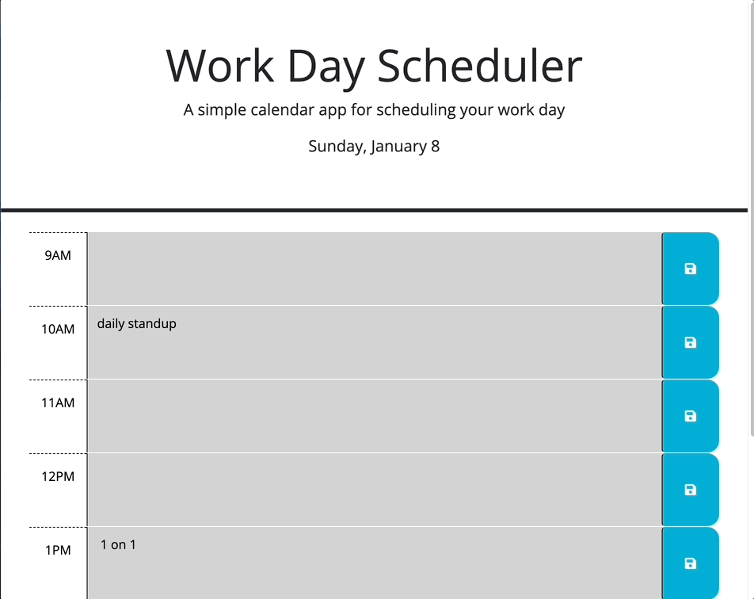

# Work Day Scheduler

## Technology Used 

| Technology Used         | Resource URL           | 
| ------------- |:-------------:| 
|  JavaScript | [https://developer.mozilla.org/en-US/docs/Web/JavaScript](https://developer.mozilla.org/en-US/docs/Web/JavaScript)     |  
|  HTML    | [https://developer.mozilla.org/en-US/docs/Web/HTML](https://developer.mozilla.org/en-US/docs/Web/HTML) | 
|  CSS     | [https://developer.mozilla.org/en-US/docs/Web/CSS](https://developer.mozilla.org/en-US/docs/Web/CSS)      |   
|  Git | [https://git-scm.com/](https://git-scm.com/)     |    

## Description 

[Visit the Deployed Site](https://mccoydidericksen.github.io/work-day-scheduler)

This website provides users with an opportunity to schedule their workday by adding events to time blocks. This application uses day.js to color code each time block depending on the current time of day. By using localStorage, users can close thier browser or refresh the page without losing previously added workday events.

## Functionality


## Code Snippets
The below function displays the previously entered schedule content to the correct time blocks on the webpage. The object in local storage (scheduleContent) consists of a key for each time block html id and it's associated user submitted content. Using the Object.Keys() method, we first create an array with the list of keys in the scheduleContent object. We then loop through each key and set the content on the page by using jQuery and the .children() method.  

```javascript
  var scheduleContent = JSON.parse(localStorage.getItem("scheduleContent"));
  
  function displayScheduleContent(){
    if(scheduleContent){
      var keys = Object.keys(scheduleContent);
      for(var i=0; i<keys.length; i++){
        var timeEl = $($("#"+keys[i]).children()[1]);
        timeEl.text(scheduleContent[keys[i]]);
      }
    }
  }
```
## Learning Points 

* Utilizing jQuery allows for easy selection, modification, and creation of HTML elements
* Without explicitly adding ids to each HTML element, we can use jQuery DOM traversal methods such as .children(), .parents(), and .siblings() to dynamically select and modify HTML elements
* Storing objects in localStorage can be an easy way to modify and add key value pairs entered by users